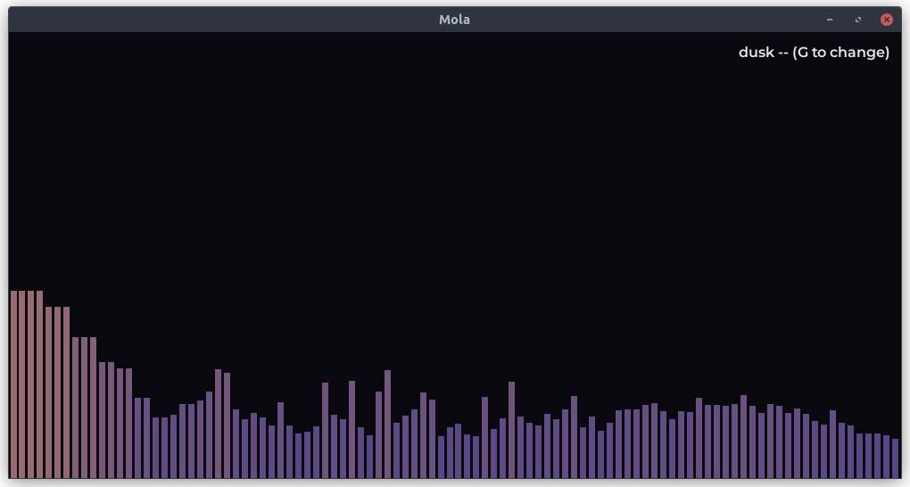
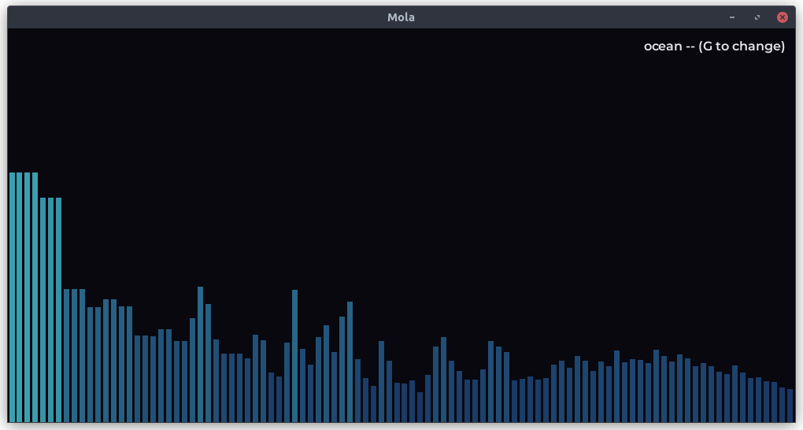
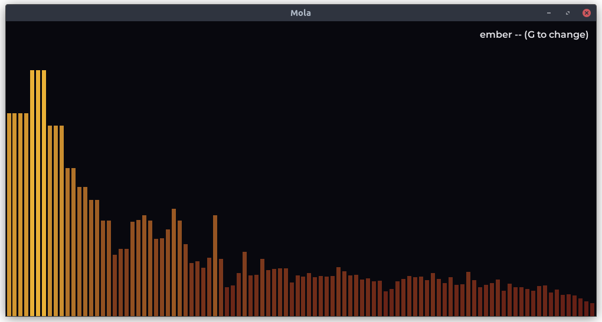
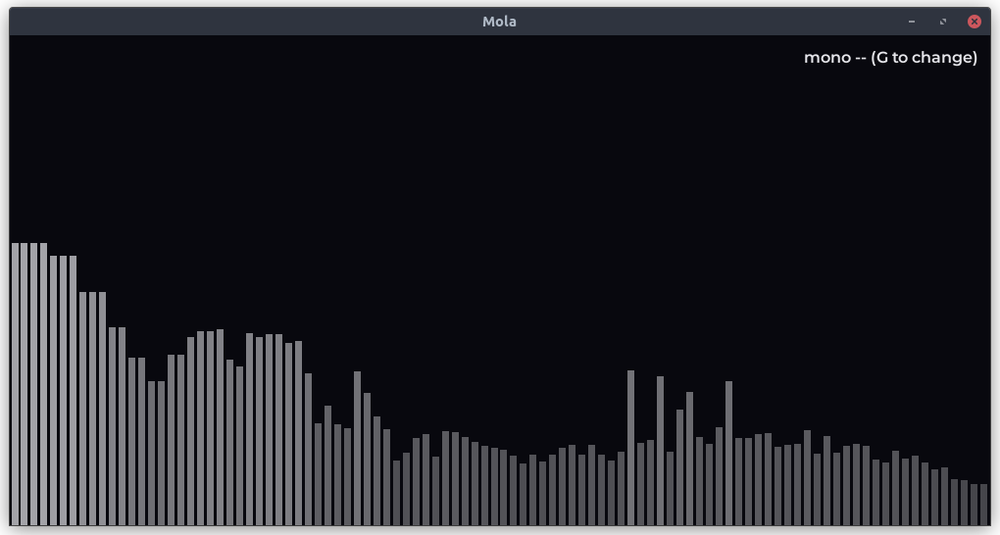
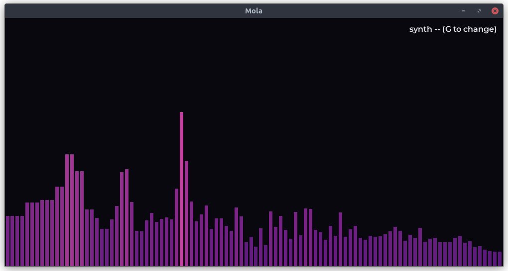
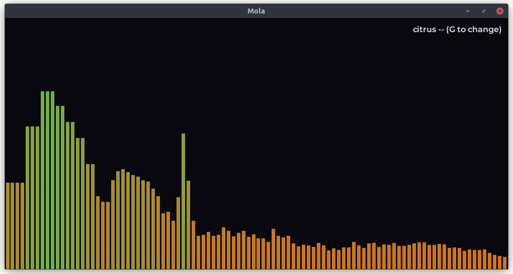
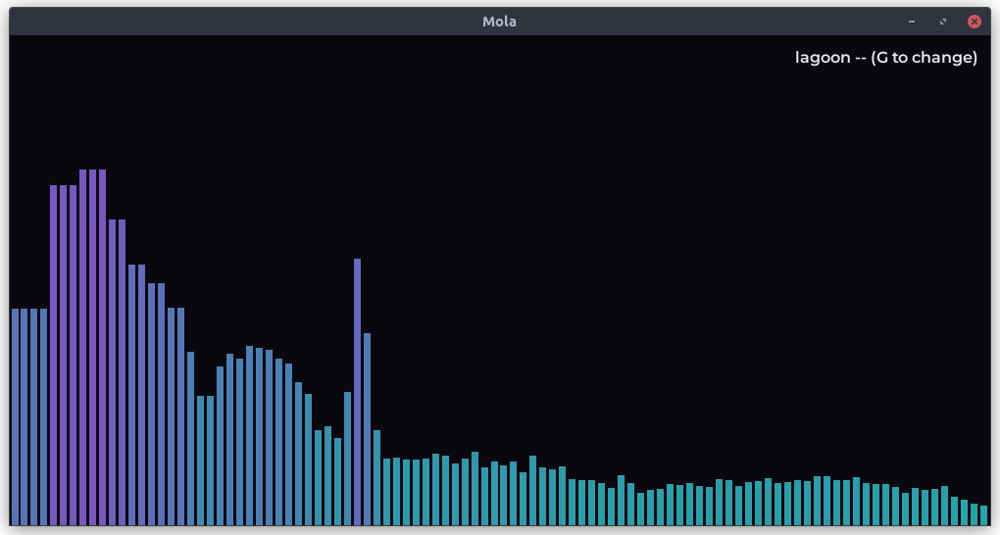
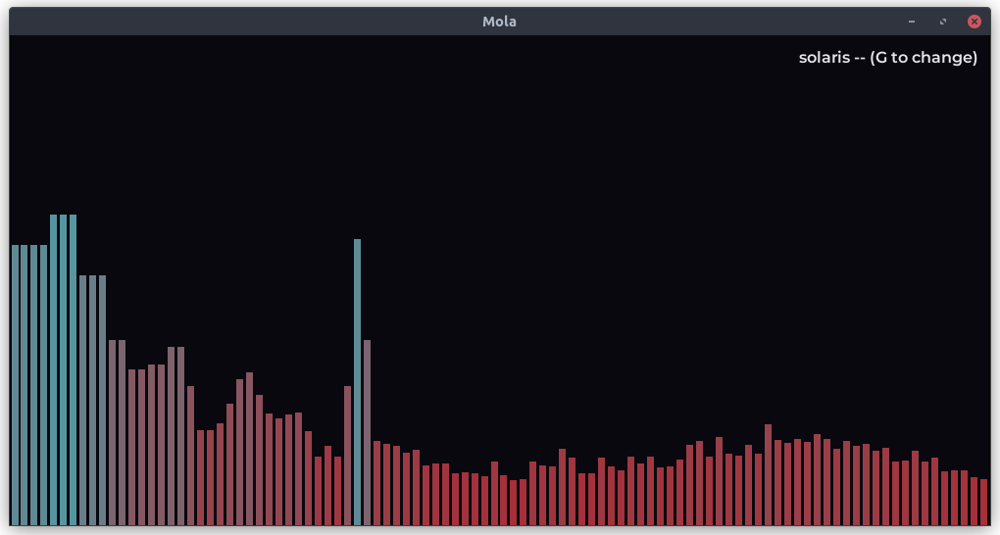
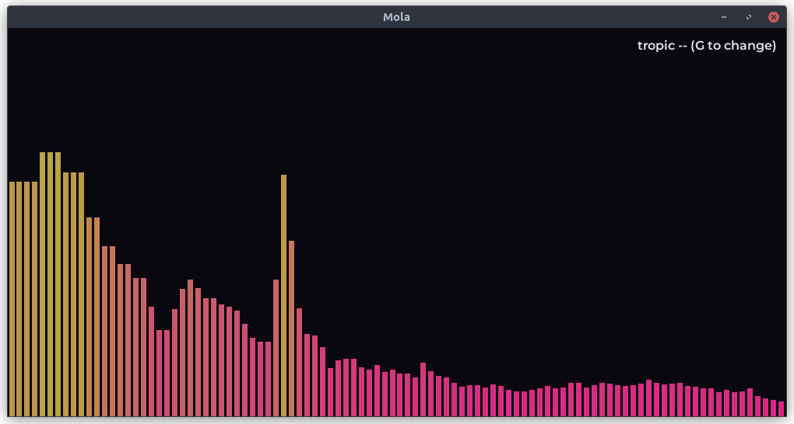
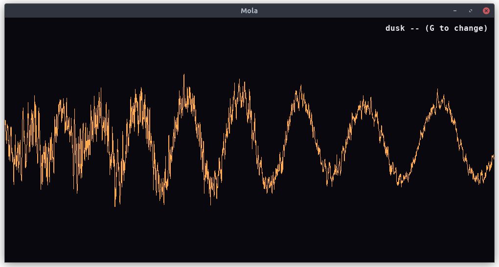

# mola

Mola is a simple audio visualizer, made for Linux, written in C, using SDL2 and PulseAudio as libraries

This was inspired by the look of [Cavasik](https://github.com/TheWisker/Cavasik) and [Cavalier](https://github.com/NickvisionApps/Cavalier), both based on [cava](https://github.com/karlstav/cava)



# Download

You can find the latest AppImage package in the **Releases** tab of this repo
With an AppImage, every library is packaged so you don't have anything to install  and you don't need root access !

# Run 

**Needs glibc 2.34 or newer** - check yours using `ldd --version`

```
chmod +x Mola-x86_64.AppImage
./Mola-x86_64.AppImage
```

If you see some FUSE errors when launching the appimage : 

```
./Mola-x86_64.AppImage --appimage-extract-and-run
```

Flags **ARE** taken by the appimage arguments 

You can also double-click the AppImage in a file explorer to launch it
This will also avoid taking up a terminal 

# Prerequisites - building from source

### With root access

```
sudo apt install build-essential pkg-config libsdl2-dev libsdl2-ttf-dev libpulse-dev
make
./mola [options]
```

### Without root access

```
apt-get download libsdl2-dev libsdl2-ttf-dev libpulse-dev
dpkg -x libsdl2-dev_*.deb ~/.local
dpkg -x libsdl2-ttf-dev_*.deb ~/.local
dpkg -x libpulse-dev_*.deb ~/.local
export PKG_CONFIG_PATH=~/.local/usr/lib/x86_64-linux-gnu/pkgconfig
export C_INCLUDE_PATH=~/.local/usr/include
make
./mola
```

## Command line flags

These also work with the AppImage !

```
-d, --device NAME      pulse source to grab (default: auto, monitor of your default sink)
-b, --bars N           how many bars (default: 100)
-s, --sensitivity F    gain on bar height (default: 0.05 -- turn up if bars stay short)
-g, --gradient NAME    color gradient, by name or index (default: dusk)
                        options: dusk, ocean, ember, mono, synth, citrus,
                        lagoon, solaris, tropic
-f, --font PATH        .ttf to draw the top-right label (default: Montserrat SemiBold)"
    --fps N            target frame rate (default: 60)
    --list-devices     print pulse sources and exit
-h, --help             print usage and exit
```

## While running

Press `SPACE` to cycle between bars, wave form, and bezier wave
Press `G` to cycle through gradients
PRESS `ESC` or `Q` to exit

You can also resize the window, the bars are made to adapt automatically !

Icon : Designed by rawpixel.com / Freepik 

### Theme schowcase











